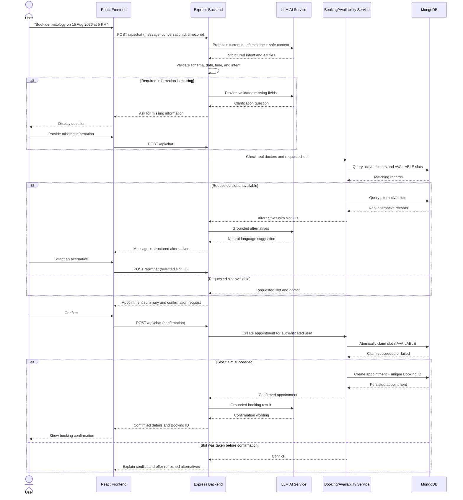
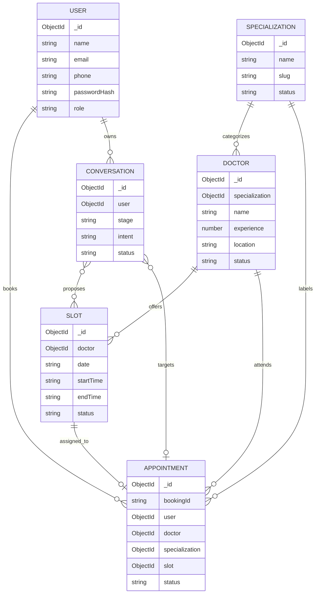

# AppointAI 🩺💬

**An AI-powered, chat-based appointment booking assistant for healthcare.**

AppointAI lets a patient book a doctor's appointment by simply chatting in plain English — no forms, no manual slot-hunting — while giving admins a dashboard to view and manage every booking.

---

## Table of Contents

1. [Abstract](#1-abstract)
2. [Spec & Plan](#2-spec--plan)
   - [2.1 System Design (High-Level)](#21-system-design-high-level)
   - [2.2 Feature Breakdown](#22-feature-breakdown)
   - [2.3 Prompt Design](#23-prompt-design)
   - [2.4 Data Model](#24-data-model)
   - [2.5 Implementation Plan](#25-implementation-plan)
3. [Implementation](#3-implementation)
4. [Edge Cases](#4-edge-cases)
5. [Getting Started](#5-getting-started)
6. [Demo Video](#6-demo-video)

---

## 1. Abstract

Booking a healthcare appointment online has always been a tedious task. Platforms like Practo and Tata 1mg already provide great services, but the process itself is still slow and frustrating — users have to manually fill out long forms, hunt through calendars for an open slot, and figure out which doctor's specialization matches their need.

**AppointAI** solves this by turning the entire booking process into a simple conversation. Instead of navigating a form, a user just tells AppointAI what they need — for example:

> *"Hey, I want to book a dermatologist appointment on 15 August 2026 at 5 p.m."*

AppointAI's AI assistant reads this natural-language request, extracts the key details (specialization, date, and time), and searches the database for a matching doctor and slot. If the slot is available, it confirms the remaining details with the user and books it by providing a unique Booking Id. If the slot is *not* available, AppointAI automatically suggests the nearest available alternatives instead of leaving the user to search manually.

**Key user flows:**

- **User flow:** Sign up/log in → describe the appointment need in chat → answer any follow-up questions the AI asks → review the suggested doctor and slot (or pick an alternative) → confirm → receive a unique Booking ID.
- 

- **Admin flow:** Log in → view all appointments → search/filter bookings → update, reschedule, or cancel a booking.
- 


By replacing the "search and fill a form" experience with a natural conversation, AppointAI removes the friction that makes appointment booking feel like a chore, while still guaranteeing that every appointment shown or booked is backed by real, live data — never something the AI invents.

---

## 2. Spec & Plan

### 2.1 System Design (High-Level)

AppointAI is built as a **MERN-stack** application (MongoDB, Express.js, React, Node.js) with one guiding rule:

> **The AI understands the user's request — the backend is responsible for validation, availability, and booking.**

The AI service never touches the database directly, never invents a doctor or slot, and never reports a booking as confirmed until the Express backend has actually created it. This keeps the system trustworthy even though the interface feels conversational and free-form.

#### Architecture Diagram

[High-level architecture]


| Component | Technology | Responsibility |
|---|---|---|
| User application | React, Vite, JavaScript | Registration, login, chat, doctor/slot selection, confirmations, appointment history |
| Admin dashboard | React, Vite, JavaScript | Protected views to manage appointments, doctors, specializations, and slots |
| API server | Node.js, Express.js | Auth, validation, chat orchestration, domain rules, REST APIs |
| AI service adapter | Node.js module → LLM API | Sends system prompt + context, requests structured output, normalizes the response |
| Appointment domain services | Node.js services | Doctor search, availability checks, alternatives, atomic booking, Booking ID generation |
| Persistence layer | MongoDB + Mongoose | Users, doctors, specializations, slots, appointments, conversations |
| Auth | JWT + password hashing | Identifies users/admins, enforces role-based access |

**Why this design?** The LLM is treated purely as a *language layer* — it interprets intent and phrases responses — while every decision that touches money-equivalent state (an actual booking) is made by deterministic backend code. This keeps the system safe from hallucinated bookings and double-booking race conditions.

#### Booking Sequence Diagram

The flow below shows exactly how a single chat message becomes a confirmed, conflict-free booking:




### 2.2 Feature Breakdown

**User features**

| Feature | Behavior |
|---|---|
| Registration/Login | JWT-based auth with name, email, phone, password |
| Conversational chat | Natural-language appointment requests, e.g. *"I need a cardiologist next Monday morning"* |
| Specialization detection | Maps everyday terms ("skin doctor") to supported specializations, with clarification if ambiguous |
| Date/time extraction | Resolves explicit and relative expressions ("tomorrow", "5 pm") using the backend's current date/timezone |
| Missing-info handling | Asks focused follow-up questions instead of guessing |
| Doctor & slot search | Returns only real, live, database-backed availability |
| Alternative suggestions | Offers nearby real slots when the requested one is taken |
| Confirmation | Shows a summary and requires explicit "yes" before booking |
| Unique Booking ID | e.g. `APT-20260815-K7M4Q2` |
| View / reschedule / cancel | Full self-service appointment management |

**AI features:** intent detection, entity extraction, conversation-state–aware follow-ups, missing-field detection, clarification questions, allow-listed backend function calling, and natural-language wording of backend-grounded results.

**Admin features:** login with role check, paginated appointment views, search/filter by Booking ID/user/doctor/specialization/date/status, reschedule/cancel with the same conflict protection as users, and full CRUD for doctors, specializations, and slots.

### 2.3 Prompt Design

Each model call is built from four controlled parts so the AI never operates on unverified assumptions:

1. **System prompt** — stable role, safety, and output-format rules (below).
2. **Runtime context** — current date/time/timezone, supported specializations, conversation stage, and the validated draft — all injected by the *backend*, never trusted from the model's own assumptions.
3. **Conversation context** — a bounded window of recent messages.
4. **Structured-output schema** — a strict JSON schema plus allow-listed backend functions the model may request.

**Simplified system prompt:**

```text
You are AppointAI, a healthcare appointment booking assistant.

Your purpose is to help authenticated users find, book, view, reschedule, and
cancel healthcare appointments through clear conversation. You are a
scheduling assistant, not a doctor — never diagnose, prescribe, or claim a
specialization is medically correct based on symptoms.

RUNTIME CONTEXT
- Current date: {{CURRENT_DATE_ISO}} | Timezone: {{TIMEZONE}}
- Supported specializations: {{SUPPORTED_SPECIALIZATIONS}}
- Conversation stage: {{CONVERSATION_STAGE}}
- Validated draft: {{VALIDATED_DRAFT}}

RULES
1. Extract intent + entities (specialization, date, time, doctor, location) from the newest message.
2. Ask ONE short clarification question at a time for missing/ambiguous fields.
3. Never invent a doctor, slot, or Booking ID — only use backend-returned data.
4. Never treat a slot as booked until the backend confirms it.
5. Always require explicit user confirmation before create/reschedule/cancel.
6. Resolve relative dates ("tomorrow") only from the provided current date/timezone.
```

The model is only ever allowed to *request* a backend operation (e.g., `checkAvailability`, `createAppointment`) with structured arguments — the backend independently validates and executes it, then optionally calls the model again to phrase the grounded result naturally. This "propose → validate → execute → narrate" loop is what keeps the assistant conversational without letting it make unsupervised changes to real data.

### 2.4 Data Model

MongoDB stores six collections, linked as shown below:



| Collection | Purpose |
|---|---|
| `User` | Stores both patients and admins (differentiated by `role: USER \| ADMIN`) |
| `Specialization` | Canonical specializations + everyday aliases ("skin doctor" → Dermatology) |
| `Doctor` | Doctor profile, specialization reference, location, active status |
| `Slot` | The atomic bookable unit — `{ doctor, date, startTime, endTime, status }`, with a unique index on `{ doctor, date, startTime }` |
| `Appointment` | The confirmed booking, snapshotting date/time/doctor for history, with a unique `bookingId` |
| `Conversation` | Server-owned chat state machine (`stage`, `draft`, `candidateSlotIds`, `pendingAction`) — the LLM never owns this state |

**Preventing double-booking:** a slot is only ever moved from `AVAILABLE → BOOKED` through one atomic, conditional update ("update this slot **only if** it is still `AVAILABLE`"). If two users try to confirm the same slot at once, only one update succeeds — the other gets a `409 SLOT_UNAVAILABLE` and fresh alternatives.

### 2.5 Implementation Plan

The system was built in phases so that the deterministic booking engine works correctly *before* the AI is wired in:

| Phase | Focus |
|---|---|
| 1 | Project setup — repo structure, environment config, base Express/React apps |
| 2 | Auth — registration, login, JWT, role-based middleware |
| 3 | Core data + admin CRUD — doctors, specializations, slots |
| 4 | Deterministic availability & booking APIs (no AI yet) — search, alternatives, atomic claim, Booking ID |
| 5 | Conversational orchestration — LLM integration, prompt design, structured output validation, chat state machine |
| 6 | User appointment management — view/reschedule/cancel |
| 7 | Admin dashboard polish — filters, pagination, reschedule/cancel UI |
| 8 | Testing — unit, integration, AI-extraction fixtures, concurrency tests |
| 9 | Deployment — static frontend host + Express service + MongoDB Atlas |

This order matters: the booking rules (validation, availability, atomic claims) are proven correct on their own before the AI is layered on top, so a bad LLM response can never bypass them.

---

## 3. Implementation

> _This section documents how the system above was actually built. Update the placeholders below with your specific setup._

**Tech stack:** React (Vite) · Node.js/Express · MongoDB (Mongoose) · JWT auth · LLM API with structured output/function calling.

**AI tools used to build this project:**
- _AI coding assistant used:_ `Claude Code `
- _AI model powering the in-app chat assistant:_ `Codex`
- _Reason for choosing it:_ `

I used both Claude Code and Codex at different stages of the project based on their strengths and cost efficiency.

- **Codex** was primarily used during the planning phase to generate the project specification, system design, and implementation plan. It was more cost-effective for these planning and documentation tasks.
- **Claude Code**, particularly **Claude Opus with Extra High effort**, was used for the most critical implementation tasks because it consistently provided strong coding results, debugging support, and reliable implementation of complex functionality.
- Since Opus with Extra High effort is relatively expensive, I reserved it for **utmost-priority coding and debugging tasks**, while using Codex for the less implementation-intensive planning work.

This approach helped balance **code quality, reasoning capability, and API/tool usage cost** throughout the development process.```
- _Approximate tokens used (assistant integration, not the coding-assistant session):_ `

According to the AI usage dashboard, during the development session:

- **Claude Opus 5:** 17.19M reported tokens (including cache tokens)
- **Claude Sonnet 5:** 1.72M reported tokens
- **GPT-5.6:** 259.2K reported tokens

The dashboard displays this usage under its **weekly usage** view. The majority of the usage came from Claude Opus, which was used for complex implementation and debugging tasks.`

**Repository structure:**

```
appointai/
├── client/                # React (Vite) user-facing app
├── admin/                 # React (Vite) admin dashboard (or a routed section of client/)
├── server/
│   ├── controllers/
│   ├── routes/
│   ├── middleware/        # auth, role checks, validation, rate limiting
│   ├── services/          # doctor/availability/appointment domain logic
│   ├── models/            # Mongoose schemas
│   ├── ai/                # LLM adapter, prompt templates, schema validation
│   └── index.js
├── docs/
│   └── images/            # architecture-diagram.png, user-flow.png, admin-flow.png
└── README.md
```

See [Getting Started](#5-getting-started) below for setup and run instructions.

---

## 4. Edge Cases

AppointAI is designed to fail safely — a confused user or a flaky model response should never result in an invented doctor, a lost booking, or a double-booked slot.

**Conversation & extraction**
- Ambiguous time (e.g., "at 5") → assistant asks AM or PM instead of guessing.
- "Tomorrow"/relative dates are resolved from the *backend's* current date and timezone, correctly across month/year boundaries — never the model's assumed date.
- Unsupported specialization → assistant asks the user to pick from supported options, without diagnosing from symptoms.
- Past dates are always rejected.
- User changes their mind mid-flow ("actually, make it 6 PM") → previous slot selection is cleared and availability is re-searched.

**Availability & booking integrity**
- Requested slot unavailable → real, ranked alternatives are suggested (never invented).
- A slot ID the model didn't receive from the backend (hallucinated or reused from an older turn) is rejected.
- Two users confirm the same slot at nearly the same time → exactly one booking succeeds; the other gets `409 SLOT_UNAVAILABLE` plus refreshed alternatives.
- Repeated confirmation clicks (double submit) use an idempotency key so only one appointment is ever created.
- A slot's specialization/date doesn't match the summary shown to the user → rejected server-side.

**Auth & authorization**
- A user cannot view, modify, or cancel another user's appointment — even if they know its Booking ID.
- A non-admin cannot call any `/api/admin/*` endpoint directly.
- Expired, invalid, or tampered JWTs return `401`.

**Admin operations**
- Deactivating a doctor does not silently cancel their existing future appointments — admin must handle those explicitly.
- Duplicate slot creation for the same doctor/date/time is rejected by a unique index.
- Admin rescheduling uses the same atomic-claim protection as user-initiated rescheduling.

**AI/infra failures**
- LLM timeout or malformed structured output → a safe retry message is shown; no database mutation occurs.
- Prompt-injection attempts in user messages cannot trigger unauthorized backend functions or fabricate results — the backend only ever executes allow-listed operations with validated arguments.

---

## 5. Getting Started

Follow the steps below to run AppointAI locally.

### Prerequisites

Make sure the following are installed:

- Node.js (v18 or later)
- npm
- MongoDB Atlas or local MongoDB
- Git
- An LLM API key

### Step 1: Clone the Repository

```bash
git clone <repo-url>
cd appointai

Step 2: Set Up the Backend

Open a terminal and run:

cd server
npm install

Create a .env file inside the server folder and add:

MONGODB_URI=your_mongodb_connection_string
JWT_SECRET=your_jwt_secret
LLM_API_KEY=your_llm_api_key
TIMEZONE=Asia/Kolkata

Start the backend:

npm run dev

The backend will run on the configured port, for example:

http://localhost:5000
Step 3: Set Up the Frontend

Open a new terminal and run:

cd appointai/client
npm install
npm run dev

The frontend will run using Vite. Open the URL shown in the terminal, usually:

http://localhost:5173
Step 4: Run the Application

Keep both the backend and frontend terminals running.

Backend:

cd server
npm run dev

Frontend:

cd client
npm run dev

Then open the frontend URL in your browser.

Step 5: Test the Application
Register or log in as a patient.
Enter an appointment request using natural language.
Select an available appointment slot.
Confirm the appointment.
Verify the generated Booking ID.
Test appointment cancellation.
Test rebooking of a cancelled slot.
Test unavailable dates and times.

Example requests:

I need a dermatologist tomorrow at 5 PM
I need a cardiologist on 20 August
Cancel my appointment APT-XXXXXXXX


Environment Variables
Variable	Description
MONGODB_URI	MongoDB connection string
JWT_SECRET	Secret used for JWT authentication
LLM_API_KEY	API key for the configured LLM service
TIMEZONE	Application timezone, e.g. Asia/Kolkata

## 6. Demo Video

📹 `<insert demo video link here — max 5 minutes, with voiceover explaining the solution>`

---

*Built as part of the Intern Role assignment — chat-based appointment booking assistant with a deterministic, non-hallucinating backend and a conversational AI front end.*
